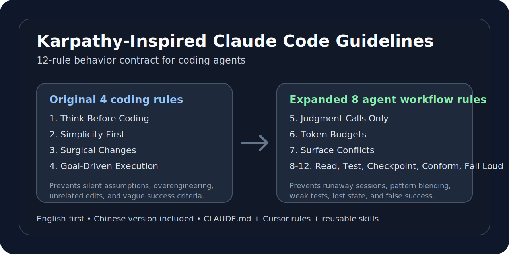

# Karpathy 启发的 Claude Code 指南 — 12 条规则

[English](./README.md) | 简体中文

这是一个英文为主、同时提供中文版本的 Claude Code / Cursor / Agent Skill 行为约束模板。它从 Andrej Karpathy 对 LLM 编码失败模式的观察出发，把原始 4 条规则扩展成适合多步骤 Agent 工作流的 12 条规则版本。

这个项目的目标不是泛泛地要求模型“认真一点”，而是把真实出现过的失败模式转化成短小、可执行、可检查的规则，并放进 `CLAUDE.md`、Cursor rules 和可复用 skill 里。

## 这个 fork 解决什么问题

原始模板主要覆盖四类编码失败：

1. 静默做错误假设，
2. 过度复杂化代码和 API，
3. 顺手修改无关代码，
4. 成功标准弱或不可验证。

这个 fork 保留这 4 条基础规则，并补充 8 条更适合 Agent 工作流的规则：确定性逻辑边界、token 预算、冲突模式处理、写前阅读、有意义的测试、检查点、遵守代码库约定，以及显式暴露失败。

## 文件结构

| 文件 | 用途 |
| --- | --- |
| [`CLAUDE.md`](./CLAUDE.md) | 英文主版本，Claude Code 12 条行为契约 |
| [`CLAUDE.zh.md`](./CLAUDE.zh.md) | 简体中文版本，同步 12 条规则 |
| [`.cursor/rules/karpathy-guidelines.mdc`](./.cursor/rules/karpathy-guidelines.mdc) | 英文 Cursor 项目规则，默认启用 |
| [`.cursor/rules/karpathy-guidelines.zh.mdc`](./.cursor/rules/karpathy-guidelines.zh.mdc) | 中文 Cursor 参考规则，默认不启用 |
| [`skills/karpathy-guidelines/SKILL.md`](./skills/karpathy-guidelines/SKILL.md) | 英文可复用 skill |
| [`skills/karpathy-guidelines-zh/SKILL.md`](./skills/karpathy-guidelines-zh/SKILL.md) | 中文可复用 skill |

## 12 条规则

| # | 规则 | 防止的问题 |
| --- | --- | --- |
| 1 | 编码前先思考 | 静默假设、隐藏困惑 |
| 2 | 简洁优先 | 过度工程、投机性功能 |
| 3 | 外科手术式修改 | 无关修改、意外重构 |
| 4 | 目标驱动执行 | 模糊任务、不可验证完成 |
| 5 | 只把模型用于需要判断力的地方 | 不稳定的模型路由/重试逻辑 |
| 6 | Token 预算不是建议 | session 失控、上下文漂移 |
| 7 | 暴露冲突，不要折中平均 | 混合互相矛盾的模式 |
| 8 | 写之前先读 | 重复代码、局部上下文错误 |
| 9 | 测试要验证意图，而不只是行为 | 浅层测试、无意义通过 |
| 10 | 每个重要步骤后设置检查点 | 多步骤漂移、状态丢失 |
| 11 | 匹配代码库约定 | 风格分叉、框架不一致 |
| 12 | 大声失败 | 假成功、隐藏不确定性 |

## 安装

### 方式 A：Claude Code 插件

在 Claude Code 中添加 marketplace 并安装插件：

```bash
/plugin marketplace add twj515895394/andrej-karpathy-skills-12
/plugin install andrej-karpathy-skills-12@karpathy-skills-12
```

这样可以在多个项目中复用该指南 skill。

### 方式 B：项目级 `CLAUDE.md`

新项目：

```bash
curl -o CLAUDE.md https://raw.githubusercontent.com/twj515895394/andrej-karpathy-skills-12/main/CLAUDE.md
```

已有项目追加：

```bash
echo "" >> CLAUDE.md
curl https://raw.githubusercontent.com/twj515895394/andrej-karpathy-skills-12/main/CLAUDE.md >> CLAUDE.md
```

中文版本：

```bash
curl -o CLAUDE.zh.md https://raw.githubusercontent.com/twj515895394/andrej-karpathy-skills-12/main/CLAUDE.zh.md
```

## 在 Cursor 中使用

仓库内已经包含 Cursor 项目规则：[`.cursor/rules/karpathy-guidelines.mdc`](./.cursor/rules/karpathy-guidelines.mdc)。该英文规则设置了 `alwaysApply: true`，打开项目时可自动生效。

中文参考规则位于 [`.cursor/rules/karpathy-guidelines.zh.mdc`](./.cursor/rules/karpathy-guidelines.zh.mdc)。它默认不自动启用，避免中英文规则重复注入导致指令压力过大。

更多说明见 [`CURSOR.md`](./CURSOR.md)。

## 定制建议

基础规则应保持短小。项目专属规则可以加在 12 条规则之后，例如：

```markdown
## Project-Specific Guidelines

- Use TypeScript strict mode.
- All API endpoints must have tests.
- Follow the existing error handling pattern in `src/utils/errors.ts`.
```

一个真正匹配你失败模式的 6 条规则文件，胜过一份塞满无用偏好的长规则文件。

## 核心思想

`CLAUDE.md` 不应该是偏好垃圾桶，而应该是一份行为契约：每条规则都应该对应一个你真实见过、想要避免的失败模式。

## 许可

MIT
